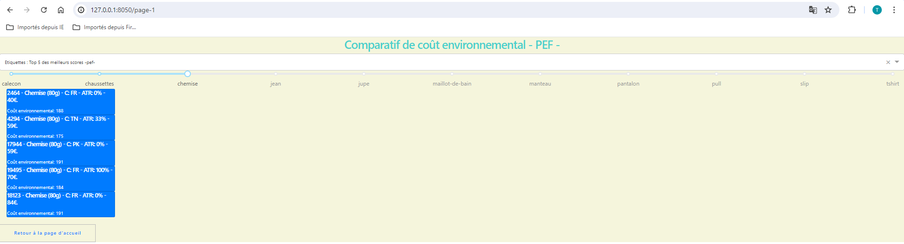
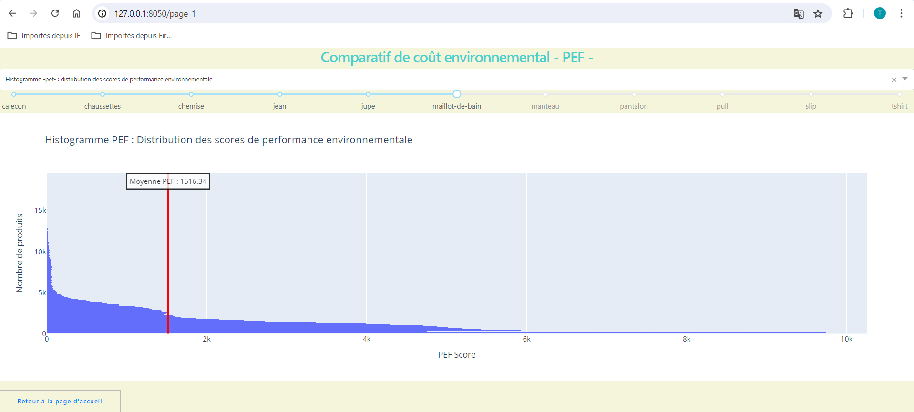

# ecblz_project
Use of the Ecobalyze API to calculate the environmental impact of textile products.
Data visualization with Dash. 

## To Start
Run the command ``python3 app/main.py``

The application is running on port 8050. 
Open the browser and follow the indications.

## Screenshots

### page 1 - environmental cost comparison - pef -

Top 5 best scores - pef - by product

Distribution of environmental performance scores

